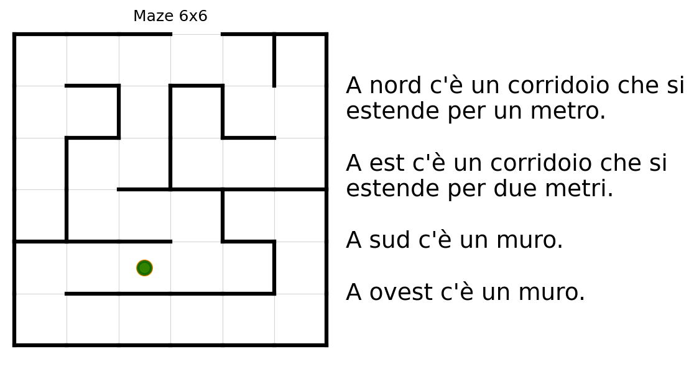
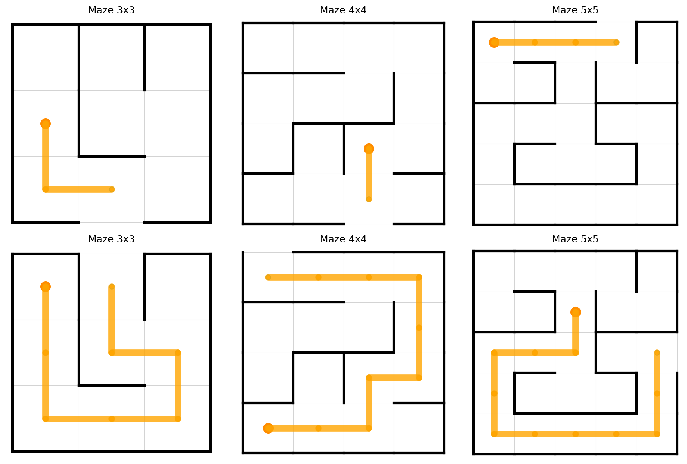
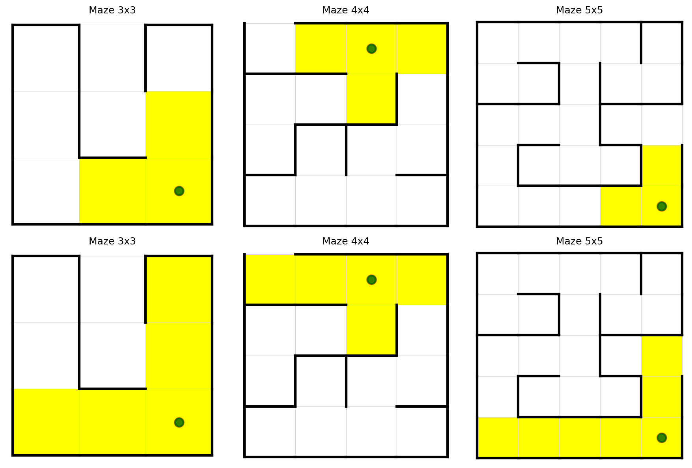
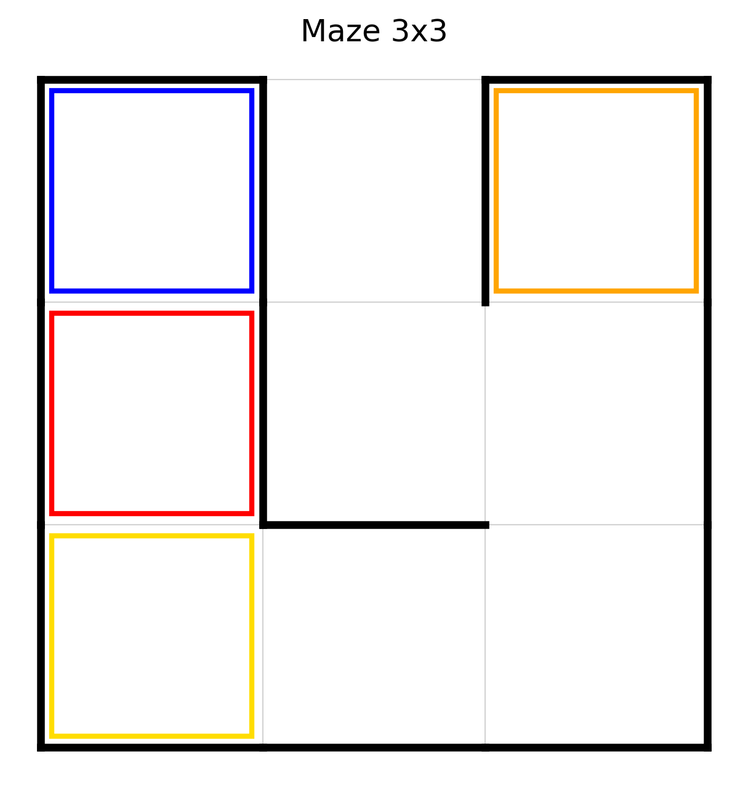
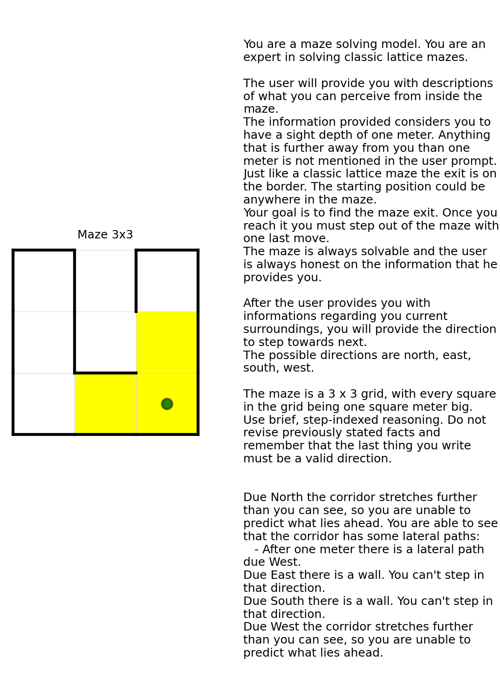
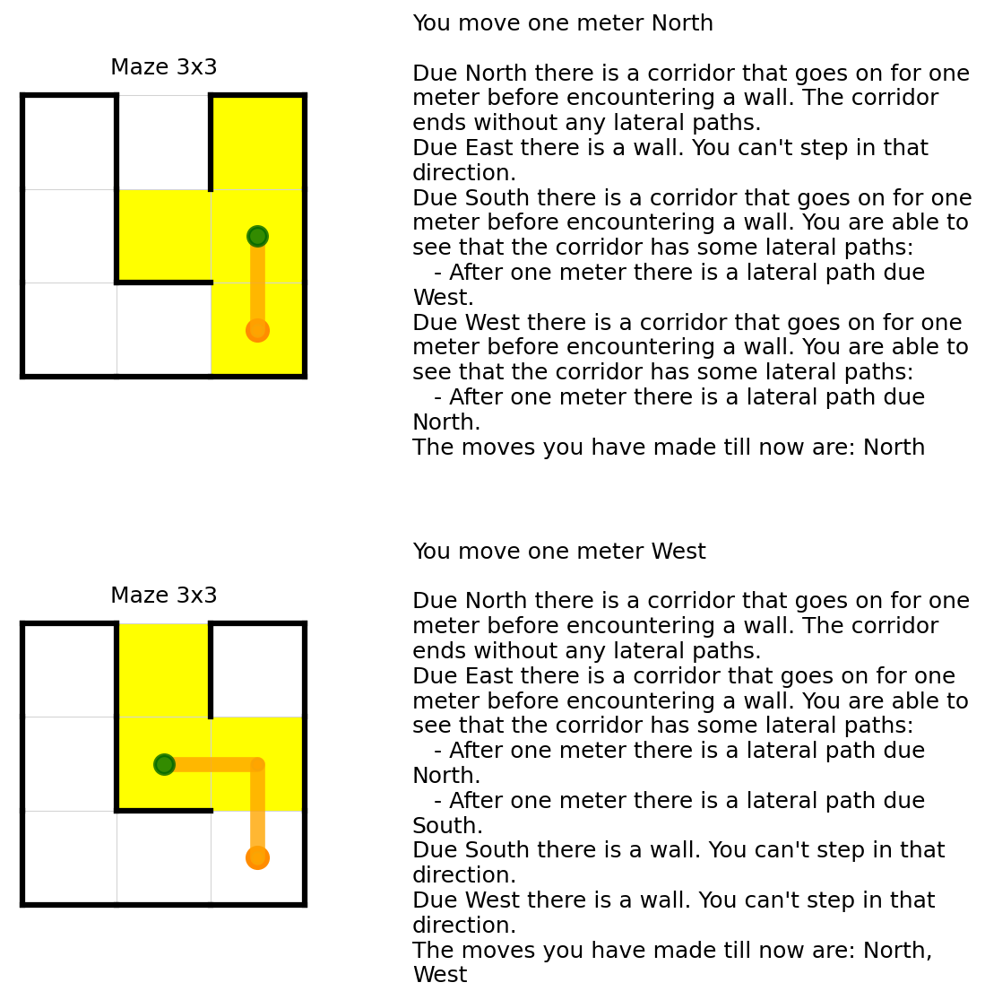
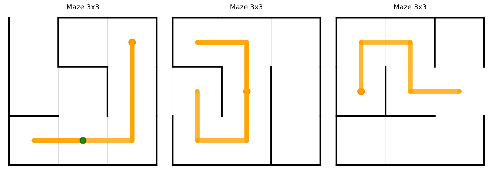

<!-- _class: lead -->

# Valutazione delle Capacità di Ragionamento dei Large Language Model:

## la risoluzione di labirinti

**Leonardo Randacio**

---

<!-- _class: lead -->

## Task

---

### Motivazioni

- azioni discrete
- successo oggettivo
- memoria necessaria
- pianificazione multi-step

---

# Generazione dei labirinti

- algoritmo Depth-First Search
- partenza e uscita scelti casualmente
- filtraggio labirinti 'facili':

---

<!-- _class: lead -->

---

# Caratteristiche dei labirinti

- sempre risolvibili
- presenza di vicoli ciechi
- unico percorso ideale

---

<!-- _class: lead -->

### Profondità di vista

---

<!-- _class: lead -->

# Celle Colorate

Le celle colorate introducono riferimenti spaziali univoci

---

<!-- _class: lead -->

### Informazioni nel preambolo

---

<!-- _class: lead -->

# Generazione del prompt

---

# Informazioni nello step prompt

- Ultima mossa eseguita
- Direzioni laterali
- Celle colorate
- Ultime mosse svolte
- Mosse disponibili

---

# Parsing dell'output

| Output del modello                                  | Azione estratta               |
| --------------------------------------------------- | ----------------------------- |
| I want to move **East**!                            | east                          |
| I should move **NORTH**!                            | north                         |
| My next move is: **s**                              | south                         |
| Let's move north, before exploring **west** better. | west |

---

# Risultati 3×3

| Modello             | % resp illegali | % dir illegali |   # passi | Risolti   |
| ------------------- | --------------: | -------------: | --------: | --------- |
| llama3:8b           |            0.11 |          12.91 |     17.33 | 6/10      |
| mistral:7b          |            0.00 |          33.33 |     36.86 | 7/10      |
| deepseek-r1:8b      |            0.00 |       **1.21** |     17.29 | 7/10      |
| deepseek-r1:32b     |            0.11 |           8.76 | **12.25** | 8/10      |
| **deepseek-r1:70b** |        **0.00** |           2.34 |     14.90 | **10/10** |

---

<!-- _class: lead -->

# Esempi di risoluzioni

---

# Risultati nxn

| Dimensione | Miglior configurazione osservata | % risolti |
| ---------- | -------------------------------- | --------: |
| **3×3**    | deepseek-r1:70b                  |  **100%** |
| **4×4**    | deepseek-r1:70b                  |   **50%** |
| **5×5**    | deepseek-r1:70b                  |   **20%** |
| **6×6**    | deepseek-r1                      |   **10%** |

---

# Osservazioni

| Dimensione  | Esito                     |
| ----------- | ------------------------- |
| **3×3**     | task spesso risolvibile   |
| **4×4**     | prestazioni già instabili |
| **5×5-6x6** | collasso quasi completo   |

---

# Osservazioni

- Buoni risultati su labirinti 3x3
- Rilevanza dimensione del modello
- Limiti:
  - memoria
  - pianificazione
  - comprensione spaziale

---

# Contributo

Benchmark:

- semplice
- controllato
- verificabile

---

## Sviluppi futuri

- confronto con modelli proprietari
- utilizzo di modelli di dimensioni maggiori
- più set di istanze
- varianti con strumenti o memoria esterna
- benchmark più ampi ma sempre verificabili

---

<!-- _class: lead -->

# Grazie per l’attenzione
